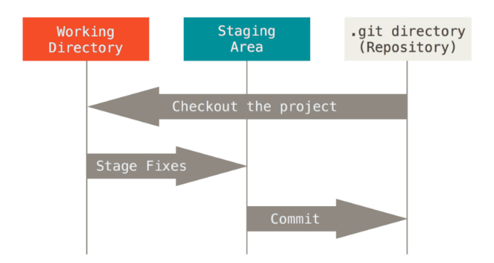

## 1 开篇概览

#### 1.1 Git是什么？

Git是一个版本控制系统（VCS），细分来讲，它是一个分布式控制系统。


每一次克隆操作，就是对代码仓库的一次完整备份。这种结构的好处在于，用户处于离线环境下，也能轻松的进行提交回滚等操作，只需联网后再上传并合并代码即可。

#### 1.2 Git对提交的修改是怎么处理的？


Git会对每一次提交做一次快照，未修改的文件会以一个链接的形式指向上一次存储的文件。

#### 1.3 Git如何保证文件的完整性

Git中所有数据在存储之前都会计算校验和。校验和的计算机制叫SHA-1散列（hash，哈希），由40个十六进制字符组成，例：


#### 1.4 Git的三种状态、三个工作区域以及工作流程分别是什么？

已修改（modified）、已暂存（staged）和已提交（committed）

由此可以引入Git项目的三个工作区域：工作目录（Working Directory）、暂存区域（Staging Area）以及Git仓库（Repository）



Git的大致工作流程如下：

​	1.在工作区域中修改文件

​	2.生成文件快照并放入暂存区域

​	3.提交更新，将暂存区域的快照永久性存储到Git仓库目录


## 2 使用Git

#### 2.1 安装

下载地址：https://git-scm.com/download （Win、Mac、Linux）。安装过程此处不多作描述，请从其它文档查阅

#### 2.2 初次运行Git前的配置

Git自带的<font color='red'>git config</font>工具可以用来设置Git外观和行为的配置变量，这些变量分别存储在三个不同位置：

​	1.<font color='red'>/etc/gitconfig</font>文件：包含系统上每一个用户以及他们仓库的通用配置。当<font color='red'>git config</font>附带<font color='red'>--system</font>选项时，它会从此文件读写配置变量。

​	2.<font color='red'>~/ .gitconfig</font>或<font color='red'>~/ .config/git/config</font>文件：只针对当前用户。使用<font color='red'>--global</font>选项可以让git读取此文件。

​	3.当前所使用仓库中的Git目录中的config文件（<font color='red'>.git/config</font>）：只针对该仓库。

每一个级别会覆盖上一级别的配置，<font color='red'>.git/config</font>的配置变量会覆盖<font color='red'>/etc/gitconfig</font>中的配置变量。

##### 2.2.1 用户配置

安装完Git之后，第一件要做的事就是配置用户名和邮件地址，因为每一次提交都会需要使用这个信息（已提交记录中的用户信息不可修改）

```shell
$ git config --global user.name "Kannagi Yuuma"
$ git config --global user.email "kannagiyuuma@example.com"
```

如果使用了<font color='red'>--global</font>选项，只需运行一次，后续任何操作，Git都会使用这些信息。当要对特定项目使用不同用户名与邮件地址时，可以在那个项目的目录下运行不带<font color='red'>--global</font>选项的命令来配置。

##### 2.2.2 文本编辑器

Git默认的文本编辑器为Vim，若是想使用其它文本编辑器，例如Emacs:

```shell
$ git config --global core.editor emacs
```

##### 2.2.3 检查配置信息

使用<font color='red'>git config --list</font>命令可以列出Git当前配置

```shell
user.name=Kannagi Yuuma
user.email=kannagiyuuma@example.com
init.defaultbranch=master
```

若是出现重复变量名，说明Git是从不同文件中读到了同一配置。这种情况下，Git会使用找到的每一个变量的最后一个配置。

如果需要检索某一项配置，可以输入命令：<font color='red'>git config \<key></font>

```shell
$git config user.name
Kannagi Yuuma
```

##### 2.2.4 获取Git仓库

1.从现有项目中初始化仓库：

```shell
$ git init
```

该命令会创建一个名为<font color='red'>.git</font>的子目录，里面包含初始Git仓库所有的必须文件。如果初始化时，当前目录并非空目录，此时应该再通过<font color='red'>git add</font>命令去对已存在文件进行跟踪，然后使用<font color='red'>git commit</font>提交。

```shell
$ git add .
$ git commit -m "initial project version"
```

以上命令详细使用，请看后文。

2.克隆一个现有的仓库

```shell
$ git clone [url]
```

例：

```shell
$ git clone https://github.com/yuuma/myProject
```

#### 2.3 记录更新到仓库

##### 2.3.1 Git目录下的文件状态

工作目录中的所有文件都能划分为两个状态之一：已跟踪（Tracked）或未跟踪（Untracked）。已跟踪文件状态又细分为未修改（Unmodified），已修改（Modified）和已暂存（Staged）。


##### 2.3.2 检查当前文件状态

使用命令<font color='red'>git status</font>可以查看当前目录的文件状态

```shell
$ git status
```

状态概览查看，在<font color='red'>git status</font>后添加<font color='red'>-s</font>或<font color='red'>--short</font>，可以得到简短紧凑的输出。

```shell
$ git status -s
M  1.txt
AM README.md
---------------------
A  表示新添加到暂存区的文件
M  表示文件已修改并且已放入暂存区
 M 表示文件已修改但并未放入暂存区
?? 新添加的未跟踪文件
AM 新文件放入暂存区后，又对文件进行了修改，但未将新版本放入暂存区
MM 已修改的文件放入暂存区后，又对文件进行了修改，但未将新版本放入暂存区
```

##### 2.3.3 忽略文件

<font color='red'>.gitignore</font>文件内指定git需要忽略的文件，例：

```shell
#idea/ #表示注释
README #忽略README文件
/resource #忽略当前resource，而不递归其它目录下的resource
resource/ #忽略resource目录下所有文件
!README #不忽略README文件，常与忽略目录组合使用
```

tip：https://github.com/github/gitignore有不同语言的忽略案例

##### 2.3.4 查看文件差异

```shell
$ git diff #查看未暂存的文件变化
$ git diff --cached #查看已暂存起来的文件变化
$ git diff --staged #同上
```

tip：git difftool --tool-help查看系统支持的git diff插件，使用git difftool来使用其它软件分析diff结果（图形化）

##### 2.3.5 提交

```shell
$ git commit
$ git commit -m "message" #附带信息提交
$ git commit -a #跳过存入暂存区操作，直接提交
```

##### 2.3.6 移除文件

```shell
$ git rm #从已跟踪清单中移除，包含本地文件
$ git rm -f #移除已放到暂存区的文件，没有历史快照情况下，不能使用Git恢复
$ git rm --cached #移除，但保留本地文件
$ git rm log/\*.log #使用glob表达式，"\"是为了防止shell转移"*",意为log目录下所有.log文件
```

##### 2.3.7 移动文件和重命名

```shell
$ git mv README.md README #重命名
```

tip：对已跟踪文件，<font color='red'>git mv</font>比直接在操作系统操作方便

#### 2.4 查看提交历史

```shell
$ git log
$ git log -p #显示每次提交的文件差异
$ git log -2 #显示最近2次提交，可以是任意正整数
$ git log --stat #显示每次提交的简略统计信息
$ git log --pretty=[format] #format可以是预设的的oneline/short/full/fuller，或是自定义格式
$ git log --since=2.weeks #列出两周前的提交记录
$ git log -S function_name #列出添加火移除指定函数名的提交记录
$ git log -- [path] #列出指定目录的历史
```

tip：https://git-scm.com/book/en/v2/Git-Basics-Viewing-the-Commit-History更多git log自定义用法

#### 2.5 撤销

##### 2.5.1 补充提交或修改提交信息

```shell
$ git commit --amend #重新提交，覆盖上一次提交，文件遗漏或提交信息错误时可使用
```

##### 2.5.2 取消暂存文件

```shell
$ git reset HEAD README.md #取消已暂存的README.md文件
```

##### 2.5.3 撤销对文件修改

```shell
$ git checkout -- README.md #撤销对README.md的修改，使其返回上一个提交记录时的状态
# ！！！ git checkout -- [file] 是一个危险命令，会修改本地文件
```

#### 2.6 远程仓库

##### 2.6.1 查看

```shell
$ git remote #查看远程仓库名
$ git remote -v #查看远程仓库名与其对应的URL
$ git remote show origin #查看某一个仓库更多信息，如查看origin仓库
```

##### 2.6.2 添加远程仓库

```shell
$ git remote add mg https://github.com/yuuma/myGateway
# git remote add <shortname> <url>
```

可以在命令行中使用仓库名代替url

```shell
$ git fetch mg
```

##### 2.6.3 从远程仓库拉取

```shell
$ git fetch origin #从远程拉取origin仓库，远程仓库默认名为origin
# git fetch [remote-name]
$ git pull master #如果本地一个分支设定为跟踪一个远程分支，可以使用pull
# git pull [branch-name]
```

##### 2.6.4 推送

```shell
$ git push origin master #推送master分支到origin仓库
# git push [remote-name] [branch-name]
```

##### 2.6.5 远程仓库重命名与移除

``` shell
$ git remote rename mg myGateway #重命名mg -> myGateway
$ git remote rm myGateway #移除
```

#### 2.7 打标签

##### 2.7.1 列出标签

```shell
$ git tag
$ git tag -l 'v1.5.5*' #列出标签v1.5.5及其衍生标签
# git show 可以查看当前标签与提交信息
# git show <tag> 可以查看指定标签的提交信息
```

##### 2.7.2 创建标签

```shell
$ git tag v1.5 #轻量标签
$ git tag -a v1.5 -m 'version 1.5' #附注标签
$ git tag -a v1.5 <hash-code> #使用指定提交的校验和（部分也可），给过去的提交打标签
```

##### 2.7.3 上传标签

```shell
$ git push origin v1.5 #携带标签上传，默认是不携带的
$ git push origin --tags #上传所有不在远程仓库的标签
```

##### 2.7.4 检出标签

```shell
$ git checkout -b test v1.6.6
$ git checkout -b [branch-name] [tag]
```

#### 2.8 Git别名

别名可以使git命令以简单、熟悉的方式来使用

```shell
$ git config --global alias.ci commit
#使用
$ git ci -m "test alias"

$ git config --global alias.unstage 'reset HEAD --'
#下面两个命令等价
$ git unstage README.md
$ git reset HEAD -- README.md
```

## 3 Git分支

<font color='red'>git init</font>默认创建master分支， 当前工作目录所处于的版本节点，称为<font color='red'>HEAD</font>


#### 3.1 分支创建

```shell
$ git branch test #创建test分支，从HEAD位置创建
$ git branch [branch-name]
```


##### 3.1.1 查看当前分支所指对象

```shell
$ git log --oneline --decorate #--decorate参数会在提交记录上显示所有分支所指的位置
$ git log --oneline --decorate --gragh --all #--gragh，以简略图形展示分支指向关系
```

##### 3.1.2 分支切换

```shell
$ git checkout test #把HEAD指向test分支
$ git checkout [branch-name]
```


#### 3.2 分支新建与合并

##### 3.2.1 新建分支并切换

```shell
$ git checkout -b iss01 #创建并切换到分支iss01
等同于
$ git branch iss01
$ git checkout iss01
```


提交修改，会移动当前分支所指提交记录会推进

```shell
$ git commit -a -m "commit one modification"
```


##### 3.2.2 删除分支

```shell
$ git branch -d iss01 #删除iss01分支
# git branch -d [branch-name]
```

##### 3.2.3 分支合并

```shell
$ git checkout master
$ git merge iss01 #把iss01分支合并到master
```


合并无冲突时，会提示<font color='red'>Fast-forward</font>，分支合并涉及冲突时，需要手动合并。在<font color='red'>git status</font>命令下，这些待解决冲突的文件，显示为<font color='red'>Unmerged</font>状态，文件内为：

```shell
<<<<<<< HEAD:README.md
读书笔记写了，但不多
=======
读书笔记写到了第三章
>>>>>>> iss01:README.md
```

由=======分隔开两个文件的差异，上半块为HEAD所指分支（master）， 下半块为iss01分支，直到<<<<<<<, =======,>>>>>>>这三种标识都被删除，才算冲突解决

###### 可视化工具使用

```shell
git mergetool
```

#### 3.3 分支管理

##### 3.3.1 查看分支

```shell
$ git branch #查看所有分支
  iss02
* master
  iss01
```

带*表示当前HEAD所指分支

```shell
$ git branch -v #查看当前所有分支的最后一次提交
$ git branch -vv #查看所有分支以及本地版本变化信息，ahead:n表示本地领先n个版本，behind:1表示落后1个版本，仅对比最后一次拉取下来的仓库数据
$ git branch --merged #查看已合并到当前分支的分支（不带*号的分支表示已合并，可以删除）
$ git branch --no-merged #查看未合并到当前分支的分支
```

#### 3.4 远程分支

##### 3.4.1 查看远程分支信息

```shell
$ git ls-remote #获取远程引用完整列表
$ git remote show #获取远程分支的更多信息
```

##### 3.4.2 推送分支

```shell
$ git push origin iss02 #推送本地分支到远程仓库上
$ git push [remote-name] [branch-name]
$ git push origin iss02:fix #将iss02分支推送到远程仓库，并命名为fix
$ git push [remote-name] [branch-name]:[remote-branch-name]
```

##### 3.4.3 跟踪分支

跟踪新分支：

```shell
$ git fetch origin #拉去远程仓库的新内容，包括新分支（新分支只是一个指针，还没有本地文件）
$ git checkout --track origin/iss05 #跟踪远程新分支，并在本地创建同名本地分支
$ git checkout -b is5 origin/iss05 #跟踪新分支并更改本地的分支名
```

使本地文件跟踪远程仓库分支：

```shell
$ git branch -u origin/iss06 
$ git branch --set-upstream-to origin/iss06
#后续可以用 @{upstream}或@{u}作为命令快捷方式，如：
$ git merge @{u}
$ git merge origin/master #同上
```

##### 3.4.4 删除远程分支

```shell
$ git push origin --delete iss02 #删除远程分支iss02，可以恢复
```

#### 3.5 变基

变基：变更基础节点的指向。使一个分支的第一个特性节点指向，从指向分支点变为指向特定分支的最新记录点。

例，初始状态：


如果用的是merge，新节点指向合并的两个分支点

```shell
$ git checkout master
$ git merge test
```


如果用的是变基，分支内容会合并到指定分支后

```shell
$ git checkout test
$ git rebase master

$ git rebase master test #一步完成，跳过checkout
$ git reabse [base-branch] [topicbranch]
```


##### 3.5.2 截取

变基除了可以把分支指向更变，还能截取分支的分支来变更分支指向，如：


加入现在要将test02的提交合并到master但是又不想合并test分支的提交，可以截取test02分支

如果截取test02分支，将获得该分支除了与test分支的共同祖先之外的节点，即c7和c8

```shell
$ git checkout test02
$ git rebase --onto master test test02
```

可以得到：


<font color='red'>tips：尽量不要对远程仓库已有的分支提交记录进行变基，不然当其它成员本地存在变基前版本并进行了后续修改的话，提交记录会很乱</font>

## 4 Git服务器

#### 4.1 协议

协议分为本地协议、HTTP协议和SSH协议。常规环境推荐HTTP协议，保密需求推荐SSH协议。

#### 4.2 在服务器上搭建Git

##### 4.2.1 裸仓库搭建

```shell
$ git clone --bare my_project my_project.git #克隆出一个新的裸仓库
$ scp -r my_project.git user@git.example.com:/opt/git #把裸仓库放到服务器上
$ ssh user@git.example.com
$ cd /opt/git/my_project.git
$ git init --bare --shared #连上服务器并初始化仓库， --shared开放写权限

$ git clone git@gitserver:/opt/git/my_project.git #其他用户拉去仓库（先得上传公钥认证）
```

#### 4.3 配置服务器

##### 4.3.1 SSH方式配置

```shell
$ sudo adduser git #创建系统用户git
$ su git #切换用户
$ mkdir .ssh && chmod 700 .ssh 
$ touch .ssh/authorized_keys && chmod 600 .ssh/authorized_keys
$ cat /tmp/id_rsa.yuuma.pub >> ~/.ssh/authorized_keys #把参与用户的公钥添加到authorized_keys文件末尾
```

#### 4.4 Git守护进程

Git守护进程可以给仓库提供只读无需授权服务，可应对大量只读需求环境

```shell
$ git daemon --reuseaddr --base-path=/opt/git/ /opt/git/ #开启守护进程
# --resueaddr 允许服务器在无需等待旧连接超时的情况下重启
# --base-path 允许用户在未完全指定路径下克隆项目
# 占用端口9418

$ initctl start local-git-daemon #不重启系统直接重启守护进程

$ touch /opt/git/mt_project.git/git-daemon-export-ok #在指定仓库下创建git-daemon-export-ok文件可以使仓库提供无需授权的项目访问服务
```

